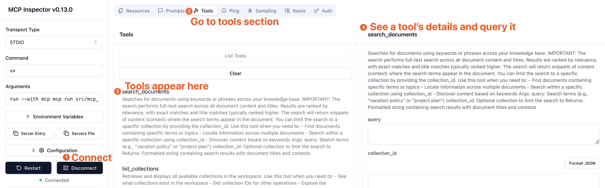

# MCP Outline Server

A Model Context Protocol (MCP) server enabling AI assistants to interact with Outline (https://www.getoutline.com)

## Overview

This project implements a Model Context Protocol (MCP) server that allows AI assistants (like Claude) to interact with Outline document services, providing a bridge between natural language interactions and Outline's document management capabilities.

## Features

Currently implemented:

- **Document Search**: Search for documents by keywords
- **Collection Management**: List collections and view document structure
- **Document Reading**: Read document content, export as markdown
- **Comment Management**: View and add comments on documents
- **Document Creation**: Create new documents in collections
- **Document Editing**: Update document content and move documents
- **Backlink Management**: View documents that link to a specific document

## Add to Cursor with Docker

We recommend running this python MCP server using Docker to avoid having to install dependencies on your machine.

1. Install and run Docker (or Docker Desktop)
2. Build the Docker image `docker buildx build -t mcp-outline .`
3. In Cursor, go to the "MCP Servers" tab and click "Add Server"
   ```json
   {
     "mcpServers": {
       "mcp-outline": {
         "command": "docker",
         "args": [
           "run",
           "-i",
           "--rm",
           "--init",
           "-e",
           "DOCKER_CONTAINER=true",
           "-e",
           "OUTLINE_API_KEY",
           "-e",
           "OUTLINE_API_URL",
           "mcp-outline"
         ],
         "env": {
           "OUTLINE_API_KEY": "<YOUR_OUTLINE_API_KEY>",
           "OUTLINE_API_URL": "<YOUR_OUTLINE_API_URL>",
           "MCP_TRANSPORT": "stdio"
         }
       }
     }
   }
   ```
   > OUTLINE_API_URL is optional, defaulting to https://app.getoutline.com/api
4. Debug the docker image by using MCP inspector and passing the docker image to it:
   ```bash
   npx @modelcontextprotocol/inspector docker run -i --rm --init -e DOCKER_CONTAINER=true --env-file .env mcp-outline
   ```

## Development

### Prerequisites

- Python 3.10+
- Outline account with API access
- Outline API key (get this from your Outline account settings)

### Installation

```bash
# Clone the repository
git clone https://github.com/Vortiago/mcp-outline.git
cd mcp-outline

# Install in development mode
uv pip install -e ".[dev]"
```

### Configuration

Create a `.env` file in the project root with the following variables:

```
# Outline API Configuration
OUTLINE_API_KEY=your_outline_api_key_here

# For cloud-hosted Outline (default)
# OUTLINE_API_URL=https://app.getoutline.com/api

# For self-hosted Outline
# OUTLINE_API_URL=https://your-outline-instance.example.com/api
```

### Running the Server

```bash
# Development mode with the MCP Inspector
mcp dev src/mcp_outline/server.py

# Or use the provided script
./start_server.sh

# Install in Claude Desktop (if available)
mcp install src/mcp_outline/server.py --name "Document Outline Assistant"
```

### Transport Mode Configuration

The MCP Outline server supports two transport modes:

- `stdio` (default): Standard input/output for direct process communication
- `sse`: HTTP Server-Sent Events for web-based communication

#### Configuring Transport Mode

Set the `MCP_TRANSPORT` environment variable to choose your transport mode:

```bash
# For stdio mode (default - backward compatible)
export MCP_TRANSPORT=stdio
mcp-outline

# For HTTP/SSE mode (useful for Docker deployments)
export MCP_TRANSPORT=sse
mcp-outline
```

#### Docker HTTP Transport

For Docker deployments, use SSE transport to enable HTTP endpoints:

```yaml
environment:
  - MCP_TRANSPORT=sse  # Enables HTTP transport on port 3001
  - OUTLINE_API_KEY=your_api_key
  - OUTLINE_API_URL=https://your-outline-instance.com/api
```

When using `MCP_TRANSPORT=sse`, the server will start on port 3001 with the following endpoints:
- `/sse` - Server-Sent Events endpoint for MCP communication
- `/messages/` - HTTP message endpoint (requires session_id parameter)

When running the MCP Inspector, go to Tools > Click on a tool > it appears on the right side so that you can query it.


## Usage Examples

### Search for Documents

```
Search for documents containing "project planning"
```

### List Collections

```
Show me all available collections
```

### Read a Document

```
Get the content of document with ID "docId123"
```

### Create a New Document

```
Create a new document titled "Research Report" in collection "colId456" with content "# Introduction\n\nThis is a research report..."
```

### Add a Comment

```
Add a comment to document "docId123" saying "This looks great, but we should add more details to the methodology section."
```

### Move a Document

```
Move document "docId123" to collection "colId789"
```

## Contributing

Contributions are welcome! Please feel free to submit a Pull Request.

## Automated versioning and releases

On every push to the `main` branch, a workflow automatically bumps the version in `pyproject.toml` and creates a Git tag:

- Major: any commit with `BREAKING CHANGE` in the body or a conventional commit using a `!` (e.g., `feat!: ...`).
- Minor: any commit starting with `feat:`.
- Patch: commits starting with `fix:`, `perf:`, `refactor:`, `chore:`, `docs:`, `build:`, `test:`, `ci:`, or `style:`; and Dependabot PR merge messages (e.g., "Bump ..." or authored by Dependabot).

If no qualifying commit is found since the last tag, the workflow makes no changes. Dependabot PRs that are auto-merged will normally trigger a patch bump.

## Development

```bash
# Run tests
uv run pytest tests/

# Format code
uv run ruff format .
```

## License

This project is licensed under the MIT License - see the [LICENSE](LICENSE) file for details.

## Acknowledgments

- Built with [MCP Python SDK](https://github.com/modelcontextprotocol/python-sdk)
- Uses [Outline API](https://getoutline.com) for document management
